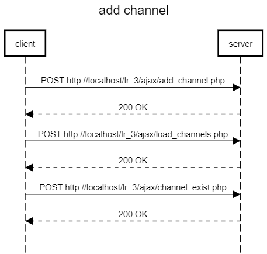
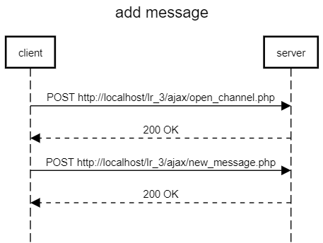

# Изучение технологии AJAX
## Текст задания
### Цель работы
Разработать и реализовать анонимный чат с возможностью создания каналов. В интерфейсе отображается список каналов, пользователь может либо подключиться к существующему каналу, либо создать новый. Сообщения доставляются пользователю без обновления страницы.
## Ход работы
- Пользовательский интерфейс
- Пользовательские сценарии работы
- API сервера и хореографию
- Структура базы данных
- Алгоритмы
1) [Пользовательский интерфейс](https://www.figma.com/file/6JGrp8VtBSu5qRGHfv6nN0/IS_lr_3?node-id=0%3A1&t=V3942LTOOiHZmebx-1)

2) Пользовательские сценарии работы

Пользователь попадает на страницу *index.php*. Регистрируется или заходит под уже зарегистрированным никнеймом. В случае корректного ввода данных, осуществляется переход на страницу *chat.php*. Есть возможность создать новый канал или присоединиться к уже существующему каналу, где возможно отправка сообщений. Также можно выйти со страницы *chat.php* c помощью кнопки *Выход*, при нажании на которую пользователь переходит на страницу *index.php*.

3. API сервера и хореография





4. Структура БД

*channels*
| Название | Тип | Длина | NULL | Описание |
| :------: | :------: | :------: | :------: | :------: |
| **id** | INT | - | - | id канала |
| **name** | TEXT | - | - | имя канала |
| **creator** | TEXT | - | - | создатель канала |
| **last_message_time** | TEXT | - | - | время последнего сообщения в канале |

*messages*
| Название | Тип | Длина | NULL | Описание |
| :------: | :------: | :------: | :------: | :------: |
| **id** | INT | - | - | id сообщения |
| **channel_id** | INT | - | - | id канала |
| **message** | TEXT | - | - | текст сообщения |
| **user** | TEXT | - | - | имя пользователя |
| **time** | TEXT | - | - | время сообщения |

*users*
| Название | Тип | Длина | NULL | Описание |
| :------: | :------: | :------: | :------: | :------: |
| **id** | INT | - | - | id пользователя |
| **nickname** | TEXT | - | - | имя пользователя |

5. Алгоритмы

*Add channel*


*Add message*


6. HTTP запросы/ответы

*Запрос*

PPOST /lr_3/ajax/new_message.php HTTP/1.1 <br>
Host: localhost <br>
Accept: text/html, */*; q=0.01 <br>
Content-Type: application/x-www-form-urlencoded; charset=UTF-8 <br>
sec-ch-ua: "Not_A Brand";v="99", "Google Chrome";v="109", "Chromium";v="109" <br>
sec-ch-ua-mobile: ?0 <br>
sec-ch-ua-platform: "Windows" <br>
User-Agent: Mozilla/5.0 (Windows NT 10.0; Win64; x64) AppleWebKit/537.36 (KHTML, like Gecko) Chrome/109.0.0.0 Safari/537.36 <br>
X-Requested-With: XMLHttpRequest <br>

*Ответ*

HTTP/1.1 200 OK <br>
Connection: Keep-Alive <br>
Content-Length: 1 <br>
Content-Type: text/html; charset=UTF-8 <br>
Date: Wed, 11 Jan 2023 22:30:48 GMT <br>
Keep-Alive: timeout=120, max=978 <br>
Server: Apache <br>
X-Content-Type-Options: nosniff <br>

7. Значимые фрагменты кода

*Функция добавления канала*
```php
function add_channel(){
        let name = prompt('Введите название');
        if (name == null || name.trim() == ""){
            alert("Введено пустое поле");
            return 0;
        }
        if (name.length > 32){
            alert("Максимальная длина названия - 32 символа");
            return 0;
        }

        $.ajax({
            url: "ajax/add_channel.php",
            type: "POST",
            cache: false,
            data: {"name": name, "creator": user},
            dataType: "html",
            success: function (data) {
                if (data == "1") {
                    load_channels();
                }
                else{
                    alert("Канал с таким названием уже существует");
                }
            }
        });
    }
```

*Функция отправления сообщения*
```php
function send_message(){
        let message = $("#new_message").val();
        $.ajax({
            url: "ajax/new_message.php",
            type: "POST",
            cache: false,
            data: {"channel_id": active_channel, "message": message, "user": user},
            dataType: "html",
            success: function(data){
                open_channel(active_channel);
                $("#new_message").val('');
            }
        });
    }
```
